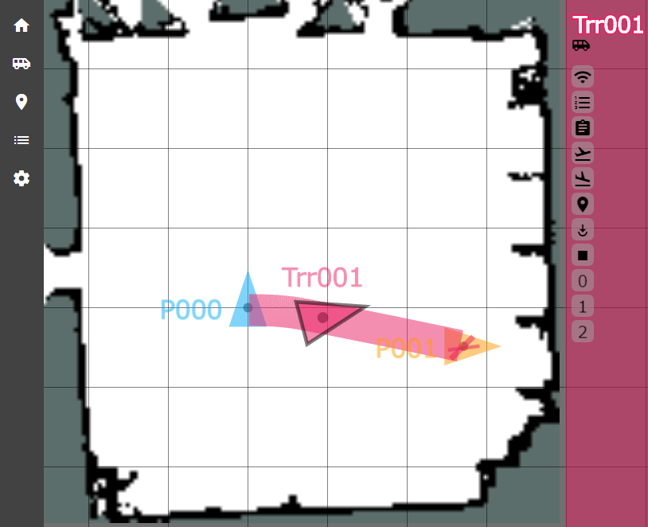

# AMR-IF-UI



AMR-IF-UI is application that implements a common IF for AMR. AMR-IF-UI has a function to send commands to the robot and a function to display the status of the robot. The UI of AMR-IF-UI consists of Sidenav, Viewer, and Contoroller. Details of the functions will be described later.

"AMR" is an abbreviation for Autonomous Mobile Robot and "IF" is an abbreviation for interface.


# Dependency

AMR-IF-UI is developed using Node.js, especially Angular framework. The following versions are confirmed.

```shell
$ node -v
v12.16.1
```


# Setup

## *Installation*

```shell
$ npm ci
```


## *Builds and serves the app, rebuilding on file changes*

```shell
$ ng serve
```


## *Compiles the app into an output directory*

```shell
$ ng build
```


# AMR-IF-UI and Autonomous Locomotion Module(Robot)

AMR-IF-UI supports AMR common IF, so Autonomous Locomotion Module(Robot) must also support AMR common IF. AMR-IF-UI and Autonomous Locomotion Module(Robot) communicate by WebSocket protocol using ROBOT WEB TOOLS. AMR-IF-UI is using roslibjs. Autonomous Locomotion Module(Robot) uses rosbridge, and can communicate via WebSocket.


# UI Elements and Functions

## *Sidenav*

Sidenav is located on the left side of AMR-IF-UI and has five icons on a gray background.

| name | description |
|:---|:---|
| Home icon | Return to home view(Sidenav, Viewer, and Contoroller). |
| Robot Setting icon | Set robot's name, color, namespace, IP address and port number for each robot. |
| Pose Setting icon | Set Pose's name, color, position and orientation for each pose. <br>This pose setting is used only for displaying in Viewer. |
| CmdList Setting icon | Set CmdList's id, cmd, params, OK_nextid, NG_nextid for each command. <br>Cmd is required. <br>Id, OK_nextid and NG_nextid is optional. <br>Some cmds need params. |
| Viewer Setting icon | Set resolution, fontSize, poseMarkerSize and rotation. <br>Resolution, fontSize and poseMarkerSize change the viewer looks. <br> Rotation can be selected 0 to 3 and rotates the viewer 90 degrees each. |

Press "Export" at the top right of the screen to save each setting to a file. Press "Import" to load the settings from a file. Press “Clear” to delete the settings.


## *Viewer*

Viewer is located in the center of AMR-IF-UI and displays the map, pose, robot's current position, and planned path.


## *Controller*

Controller is on the right side of AMR-IF-UI, and the robot name, icons, and buttons are displayed with the background color of the selected robot's setting color. If there are NO robot settings, controller will NOT be displayed. You can use the button on the controller to send command to the selected robot.

| name | description |
|:---|:---|
| Robot name | Display the name of selected robot. |
| Robot icon | Change the operating robot. Select a robot from the dialog. |
| Connection icon | Display connection status. <br>If connected, display connect icon. <br>If disconnected, display disconnect icon.  |
| CmdList Execution button | Run cmdlist. Select a cmdlist and starting index from the dialog. |
| Command Execution button | Run command. Select a command and options if necessary from the dialog. |
| run_nav command button | Run "run_nav". Select a mapfile name from the dialog.  |
| kill_nav command button | Run "kill_nav". |
| set_pose command button | Run "set_pose". Select a mapfile name and pose name at robot current pose name from the dialog. |
| goto command button | Run "goto". Select a mapfile name and goal pose name from the dialog. |
| cancel command button | Run "cancel". |
| CmdList 0 Shortcut button | Run id0 cmdlist from the beginning. |
| CmdList 1 Shortcut button | Run id1 cmdlist from the beginning. |
| CmdList 2 Shortcut button | Run id2 cmdlist from the beginning. |


# Viewer Key Control

| Key | function |
|:---|:---|
| Arrow Right | right move |
| Arrow Left | left move |
| Arrow Up | up move |
| Arrow Down | down move |
| Page Up | zoom in|
| Page Down | zoom out |
| Home | default position |
| End | default position |

Fine adjustment possible while holding down the Shift key.


# Command

AMR-IF-UI supports some commands. These commands are defined in "src / assets / configs / config.json".


## *Command kind*

AMR-IF-UI supports five single commands and one mixed command. Single commands are "run_nav", "kill_nav", "set_pose", "goto" and "cancel". Mixed command is "cmdlist".

* Single commands

| cmd | parameter | description |
|:---|:---|:---|
| run_nav | mapfile_name | The robot starts the autonomous movement function. Execute only once before starting autonomous movement. |
| kill_nav | - | The robot ends the autonomous movement function. Run run_nav to resume autonomous movement. |
| set_pose | mapfile_name, <br>pose_name | Notify the current position to the robot at the start of autonomous movement. |
| goto | mapfile_name, <br>goal_name | Instruct the robot to move. |
| cancel | - | Stop moving. |

* Mixed command

| cmd | parameter | description |
|:---|:---|:---|
| cmdlist | start_index | A series of commands. Commands are executed in order. When the command completes, execute the following command. If OK_nextid is specified, execute the command of OK_nextid. If an error occurs in the command, the CmdList ends. But NG_nextid is specified, execute the command of NG_nextid. |


## *Command structure*
Commands consist of a type, request, and response. See "config.json" for details.


## *Type*

Command belongs to the following types. Each type has a different topic name and messageType.
Topic name and messageType are different for request and response.

| type | topic | messageType | cmd | description |
|:---|:---|:---|:---|:---|
| stop | /namespace/stop_cmd, <br>/namespace/stop_res | trr_msgs/RoboCmd, <br>trr_msgs/RoboRes | cancel | Emergency command. Respond immediately. Even if processing is being executed, processing is performed by interruption. |
| robo | /namespace/robo_cmd, <br>/namespace/robo_res | trr_msgs/RoboCmd, <br>trr_msgs/RoboRes | run_nav, <br>kill_nav, <br>set_pose | Commands related to robots. Process one by one. When the processing is being executed, new commands are accumulated in a queue and are sequentially processed. |
| navi | /namespace/navi_cmd, <br>/namespace/navi_res | trr_msgs/RoboCmd, <br>trr_msgs/RoboRes | goto | Commands related to navigation. Only process one. When the processing is being executed, the new command is rejected and not accepted. |
| cmdlist | /namespace/robo_cmdlist, <br>/namespace/robo_reslist | trr_msgs/RoboCmdList, <br>trr_msgs/RoboResList | cmdlist | A series of commands. Only process one. When the processing is being executed, the new command is rejected and not accepted. |

A namespace is added to the beginning of the topic name according to the robot settings.


## *messageType*

MessageType above consists of the following fields.

| messageType | fields |
|:---|:---|
| trr_msgs/RoboCmd | string    id<br>string    cmd<br>string[]  params<br>string[]  nextid |
| trr_msgs/RoboRes | string    id<br>string    cmd<br>string[]  params<br>string[]  nextid<br>string    status |
| trr_msgs/RoboCmdList | string               id<br>trr_msgs/RoboCmd[]   cmdlist<br>string[]             params |
| trr_msgs/RoboResList | string                id<br>trr_msgs/RoboRes[]    reslist<br>string[]              params<br>string                status<br>uint16                count |


## *Request*

Request is a message sent from the AMR-IF-UI to the robot.


## *Response*

Response is a message sent from the robot to the AMR-IF-UI.
Response message has the following status in addition to Request.

| status | description |
|:---|:---|
| succeeded | Success |
| rejected | Reject. Error before execution(setting parameter error, etc.) |
| aborted | Failure. Error during execution(error detection, error, etc.) |
| processing | Running command |
| preempted | Canceling a running command by cancel |


## *Add original command*

By modifying "config.json", you can add commands or change the current command settings. You do NOT need to change the AMR-IF-UI code, but you need to restart AMR-IF-UI and reload "config.json".


# ROS message displayed on Viewer

AMR-IF-UI receives the following topics and displays them on the Viewer.

| topic | messageType | description |
|:---|:---|:---|
| /namespace/floormap | nav_msgs/OccupancyGrid | floormap |
| /namespace/robot_pose | geometry_msgs/PoseStamped | pose with time stamped|
| /namespace/move_base/NavfnROS/plan | nav_msgs/Path | planned path(move_base) |
| /namespace/move_base/result | move_base_msgs/MoveBaseActionResult | goal notification(move_base) |
| /namespace/move_base_flex/get_path/result | mbf_msgs/GetPathActionResult | planned path(move_base_flex) |
| /namespace/move_base_flex/exe_path/result | mbf_msgs/ExePathActionResult | goal notification(move_base_flex) |

A namespace is added to the beginning of the topic name according to the robot settings. For the above messageType, refer to ROS documentation.


# LocalStorage

AMR-IF-UI saves the settings to LocalStorage. The settings will be restored from LocalStorage even if AMR-IF-UI is restarted. The data stored in LocalStorage are robot settings, pose settings, cmdlist settings, viewer settings, viewer display position and scale. To reset LocalStorage to the default value, press "RESET All" at the bottom right of the viewer settings.


# Source Tree

```
AMR-IF-UI/
|-- img
`-- src
    |-- app
    |   |-- cmd-lists           // component of cmdlist setting
    |   |   |-- cmd-list-detail
    |   |   |-- cmd-list-form
    |   |   `-- shared
    |   |-- commands            // component of command setting
    |   |   `-- shared
    |   |-- home                // main component(dummy)
    |   |-- poses               // component of pose setting
    |   |   |-- pose-detail
    |   |   |-- pose-form
    |   |   `-- shared
    |   |-- robots              // component of robot setting
    |   |   |-- robot-detail
    |   |   |-- robot-form
    |   |   `-- shared
    |   |-- settings            // component of setting
    |   |   |-- setting-detail
    |   |   `-- shared
    |   |-- shared
    |   |   |-- config          // initial setting
    |   |   |-- ros             // processing related to ROS
    |   |   |   `-- messages    // topic type
    |   |   |-- storage         // processing related to data management
    |   |   `-- store           // processing related to LocalStorage
    |   |-- sidenav             // sidenav
    |   `-- viewer
    |       |-- input-dialog    // dialog for selecting parameter
    |       |-- select-dialog   // dialog for selecting robot, command, etc
    |       `-- shared
    |           |-- markers     // processing to display Viewer
    |           `-- protocol    // config.json analysis
    |-- assets
    |   |-- configs             // command definition
    |   |   `-- reset           // default setting
    |   `-- icons
    `-- environments
```


# License

Copyright (C) 2020 TOSHIBA Corporation.<br>
All rights reserved.<br>
The 2-Clause BSD License.

The default theme uses Material Design icons by Google licensed under Apache license version 2.0.
https://github.com/google/material-design-icons


# Acknowledgment

Development was partially based on a theme concept and a result obtained from a project commissioned by the New Energy and Industrial Technology Development Organization (NEDO).

