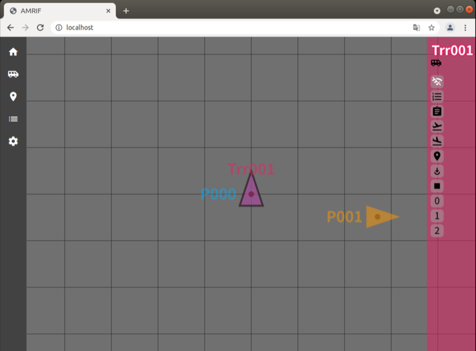

# AMR-IF-UI: Deployment

<!-- TOC -->

- [1. Deployment](#1-deployment)
    - [1.1. Build](#11-build)
    - [1.2. Chaging base URL](#12-chaging-base-url)

<!-- /TOC -->

## 1. Deployment

AMR-IF-UI is constructed on Angular framework, and it can improve the
loading speed in the browser by transpiling (compiling) it in advance
with the AOT (Ahead-of-time) compiler. And can be deployed on a web
server that does not have nodejs/npm etc. installed.

(However, AMR-IF-UI itself depends on ROS/Robot Web Tools, so you need
to install the required packages separately.)


### 1.1. Build

Enter the ng build command in the project root directory of the AMR-IF-UI.

```shell
$ ls
LICENSE			README.md		browserslist		img			
ngsw-config.json	package-lock.json	src			tsconfig.json
tslint.json LICENSE_HEADER		angular.json		karma.conf.js
package.json		tsconfig.app.json	tsconfig.spec.json
$ ng build
Compiling @angular/cdk/keycodes : es2015 as esm2015
Compiling @angular/animations : es2015 as esm2015
  : 

  :
chunk {vendor} vendor-es5.js, vendor-es5.js.map (vendor) 7.42 MB [initial] [rendered]
Date: 2021-09-23T14:35:03.634Z - Hash: 36137cafdae0110f8877 - Time: 101231ms

```

A directory such as "dist/AMR-IF-UI" will be created, in which
deployable packages have been generated.

```shell
$ cd dist/AMR-IF-UI/
$ ls
assets			main-es2015.js		main-es5.js		manifest.webmanifest
 : 
styles-es2015.js	styles-es5.js		vendor-es2015.js	vendor-es5.js
$
```

You can publish this project by copying the files in this directory to a
publicly available directory on your HTTP server.

Let's assume that "/var/www/data" is empty and is the Apache's Document Root.

```shell
$ sudo cp * /var/www/data/
```
If apache is running, you will see the following screen when you access http://localhost.

- [http://localhost](http://localhost)



### 1.2. Chaging base URL

In some cases, you may want to publish at a URL below a specific
directory instead of publishing at the document root of the web server.

In that case, when building, use the "--base-href=option" to specify the
path of the hierarchy to expose.


```shell
$ cd <project root>
$ ng build --base-href=/AMR-IF-UI/
$ cd dist
$ sudo cp -r AMR-IF-UI /var/www/data/
```

This will allow you to access the AMR-IF-UI at http://localhost/AMR-IF-UI/.

- [http://localhost/AMR-IF-UI/](http://localhost/AMR-IF-UI/)

